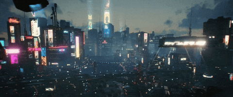
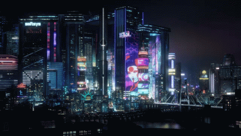

<div align="center">

<!-- ═══════════════════════════════════════════════════════════ -->
<!--           SWAP THIS with a CP2077 city skyline GIF        -->
<!--  e.g. Night City aerial shot / neon streets in rain       -->
<!-- ═══════════════════════════════════════════════════════════ -->


<!-- If you don't have a gif yet, uncomment this capsule fallback: -->
<!--

-->

</div>

<div align="center">
  
</div>

<br>

<div align="center">

```
╔══════════════════════════════════════════════════════════════════╗
║  ░▒▓ NEURAL INTERFACE BOOT SEQUENCE INITIATED ▓▒░               ║
║  >> Handshake with NET...                           [████████]  ║
║  >> Loading RIPPERDOC enhancements...               [████████]  ║
║  >> ICE bypass protocols armed...                   [ ARMED  ]  ║
║  >> Flatline protection: ACTIVE                     [  ONLINE ] ║
╚══════════════════════════════════════════════════════════════════╝
```

</div>

---

## `>> OPERATIVE DOSSIER`

<!-- ═══════════════════════════════════════════════════════════ -->
<!--   SWAP THIS with a CP2077 character art / V / Johnny GIF  -->
<!--   e.g. Johnny Silverhand pointing, V with mantis blades   -->
<!-- ═══════════════════════════════════════════════════════════ -->


```yaml
HANDLE     : Siddharth Tashildar
ALIAS      : Sid // The Netrunner
CLASS      : Full-Stack Chrome // Embedded Systems // Network Operative
CITY       : Night City (Surat, IN)
STATUS     : 🟡 ONLINE — Jacked in, building in the dark
FACTION    : Independent Merc // CS Undergrad

NEURAL IMPLANTS (Languages):
  ├─ Python      ████████████  MAX
  ├─ C / C++     ██████████░░  HIGH
  ├─ JavaScript  █████████░░░  HIGH
  ├─ TypeScript  ████████░░░░  MID
  ├─ C#          ██████░░░░░░  MID
  └─ HTML / CSS  ████████████  MAX

THREAT LEVEL : ██████████ GONK-DESTROYER
```

<br clear="right"/>

---

## `>> CHROME & CYBERWARE` &nbsp; *(Tech Stack)*

<div align="center">

**`── NEURAL OS ──`**


**`── COMBAT RIGS (Frameworks) ──`**


**`── STREET TECH (Embedded & Hardware) ──`**


**`── DATA VAULTS (Databases) ──`**


**`── NETRUNNER TOOLS ──`**


</div>

---

## `>> THE RELIC // Featured Build`

<!-- ═══════════════════════════════════════════════════════════ -->
<!--   SWAP THIS with a CP2077 hacking / glitch scene GIF      -->
<!--   e.g. the braindance scene, netrunning interface, etc.   -->
<!-- ═══════════════════════════════════════════════════════════ -->
<div align="center">

</div>

<br>

> *"The Relic doesn't just store data — it rewrites who you are. My builds do the same."*

<!-- ```
╔═══════════════════════════════════════════════════════════════╗
║  PROJECT : NETWATCH — Real-time Network Analyzer              ║
║  CLASS   : Offensive Netrunner Rig                            ║
╠═══════════════════════════════════════════════════════════════╣
║  STACK   : Scapy // FastAPI // Next.js // SSE Streaming       ║
║  ENGINE  : Isolation Forest — ML Anomaly Detection            ║
║  STATUS  : ██████████ DEPLOYED // SCANNING                    ║
║                                                               ║
║  "Sniffs every packet on the wire. Flags the gonks before     ║
║   they even know they've been made. Corps hate this rig."     ║
╚═══════════════════════════════════════════════════════════════╝
``` -->

---

## `>> NEURAL METRICS` &nbsp; *(GitHub Stats)*

<div align="center">

<!-- ═══════════════════════════════════════════════════════════ -->
<!--   SWAP THIS with a CP2077 stats / HUD screenshot PNG      -->
<!--   e.g. V's stat screen, attribute upgrade screen          -->
<!-- ═══════════════════════════════════════════════════════════ -->


<br><br>


&nbsp;


<br><br>


</div>

---

## `>> TRANSMISSION LINES` &nbsp; *(Contact)*

<div align="center">

[](https://github.com/siddharthtashildar)
[](mailto:code.sid17@gmail.com)
[](https://linkedin.com/in/YOUR_LINKEDIN_SLUG)

</div>

---

<!-- ═══════════════════════════════════════════════════════════ -->
<!--   SWAP THIS with a CP2077 outro scene GIF                 -->
<!--   e.g. Night City rain, Johnny on the roof, V driving     -->
<!-- ═══════════════════════════════════════════════════════════ -->
<div align="center">

</div>

<div align="center">

```
╔══════════════════════════════════════════════════════════════════╗
║  >> SESSION TERMINATED                                          ║
║  >> Neural interface safely disconnected from the NET           ║
║  >> Wake the f*ck up, Samurai. We have a city to burn.  🔥      ║
╚══════════════════════════════════════════════════════════════════╝
```


</div>